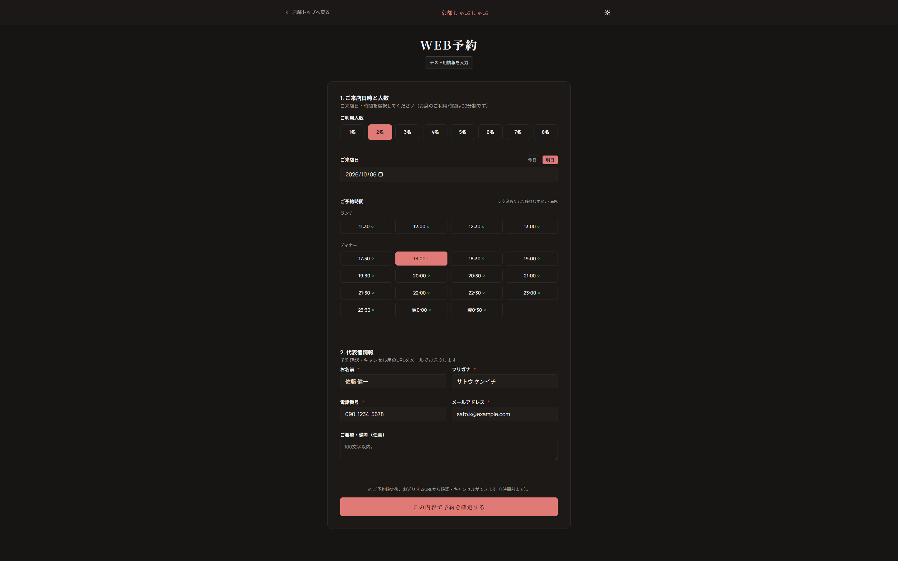
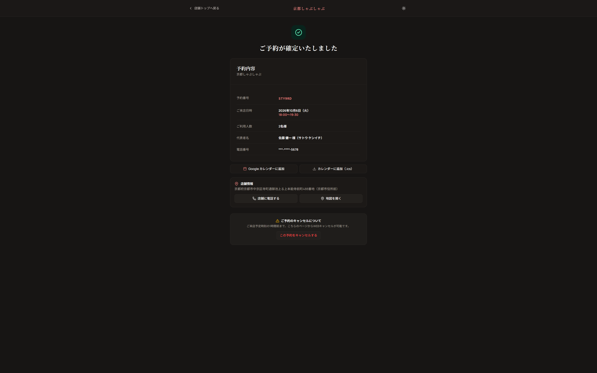
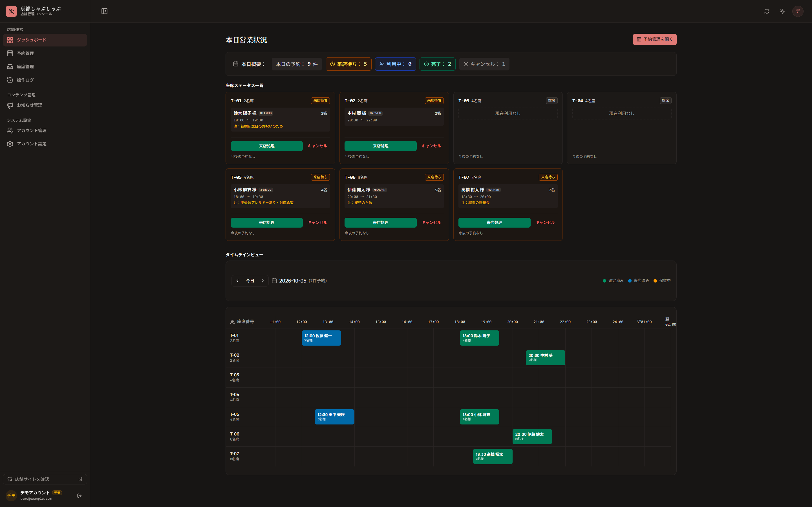

# yoyaku-kit

[English](./README.md)

Next.js 16 と PostgreSQL で構築した、飲食店向け軽量予約・テーブル管理システムです。

日本国内の小規模・単店舗レストランを対象として設計しており、日本語環境に最適化されたUI/UXを提供します。

[ライブデモ](https://yoyaku-kit-demo.vercel.app)

## 機能

### 顧客向け




- アカウント不要でテーブルを予約
- 視認性の高い6桁の予約番号を発行
- 専用リンクから予約状況を確認
- キャンセル受付時間内であれば予約をキャンセル可能
- iCalendar形式での予約エクスポート

### スタッフ・管理者向け



- 予約番号または顧客情報による予約の検索・管理
- テーブルの割り当て・変更
- チェックインおよびノーショー（無断不来店）対応
- 店舗情報・お知らせの管理
- 予約履歴・操作監査ログの閲覧
- スタッフ・管理者それぞれのロールベースアクセス制御

### 予約処理

- 予約人数に応じたテーブルの自動割り当て
- 視認性の高い6桁の予約番号
- 日付をまたぐ営業時間への対応
- 同時予約の競合防止
- キャンセルおよびノーショーの時間ルール管理

## 技術スタック

- **フレームワーク:** Next.js 16、React 19
- **言語:** TypeScript
- **データベース:** PostgreSQL 16
- **ORM:** Drizzle ORM
- **認証:** Better Auth
- **UI:** Tailwind CSS 4、Radix UI、Lucide
- **テスト:** Vitest
- **ツールチェーン:** Biome、Docker Compose

## 設計上の注意点

### 二重予約の防止

予約作成時はデータベーストランザクションと行レベルロックを組み合わせて排他制御を行います。さらに PostgreSQL の排他制約（Exclusion Constraint）がデータベース層での重複予約を保証します。

### 予約番号の設計

予約番号は、視認しやすい32文字のBase32セット（`ABCDEFGHJKLMNPQRSTUVWXYZ23456789`）から6文字を生成します。混同しやすい文字（`I`、`O`、`0`、`1`）は除外しています。一意性はPostgreSQLのユニークインデックスで担保し、内部の外部キーやトークン検証には引き続きプライマリUUIDとハッシュ値を使用します。

### 時刻の取り扱い

予約はUTCタイムスタンプで保存され、店舗に設定されたIANAタイムゾーンを用いて表示時に変換します。営業時間が日付をまたぐ場合も、元のサービス日付に紐付けた状態で管理できます。

### ゲスト予約

ゲスト予約はアカウントなしで利用できます。各予約には予約内容の確認・キャンセル用のセキュアトークンが発行されますが、データベースにはそのハッシュ値のみを保存します。

## プロジェクト構成

```text
Restaurant
├── Tables
├── Business Hours
├── Reservations
├── News
└── Staff / Managers
```

## セットアップ

### 必要要件

- Node.js 22+
- pnpm 9+
- Docker & Docker Compose

### インストール

```bash
git clone https://github.com/aaakul/yoyaku-kit.git
cd yoyaku-kit
pnpm install
```

`.env.example` をコピーして `.env` を作成し、PostgreSQLを起動します。

```bash
docker compose up -d
```

データベースを初期化します。

```bash
pnpm db:init
```

開発サーバーを起動します。

```bash
pnpm dev
```

ブラウザで [http://localhost:3000](http://localhost:3000) を開きます。

### デフォルトのログイン情報

[http://localhost:3000/sign-in](http://localhost:3000/sign-in) を開いてください。

| ロール   | メールアドレス         | パスワード   |
| -------- | ---------------------- | ------------ |
| Manager  | `admin@example.com`   | `12345678`   |
| Demo     | `demo@example.com`    | `12345678`   |

## スクリプト

| コマンド         | 説明                             |
| ---------------- | -------------------------------- |
| `pnpm dev`       | 開発サーバーの起動               |
| `pnpm build`     | 本番ビルドの生成                 |
| `pnpm test`      | テストの実行                     |
| `pnpm typecheck` | TypeScript 型チェック            |
| `pnpm check`     | Biome によるコードチェック       |
| `pnpm db:init`   | データベースの初期化とシード投入 |
| `pnpm db:reset`  | データベースのリセットとシード再投入 |

## ライセンス

MIT
